# Báo cáo tuần 4 (24/07/23 - 30/07/2)

## Basic computer networking

Một khối cơ bản của Computer network bao gồm các Nodes và Links. Network Node là các thiết bị giao tiếp dữ liệu (Data Communication) như Modem, Router. Link trong Computer Network là wire hoặc cáp, hoặc không gian truyền của wireless networks.

#### Basic Terminologies of Computer Networks

- **Network:** là tập hợp các máy tính hoặc thiết bị được kết nối với nhau và có thể giao tiếp, trao đổi dữ liệu lẫn nhau.
- **Nodes:** là các thiết bị kết nối đến Network. Có thể là computer, Server, Printer, Router, Switches và các thiết bị khác.
- **Protocol:** Giao thức là một tập hợp các quy tắc và tiêu chuẩn để quản lý các truyền dữ liệu trong network. Các protocols như TCP/IP, HTTP, FTP.
- **Topology:** Cấu trúc liên kết là cách sắp xếp vật lý và logic của các Nodes trong Network. Các Topology phổ biến như bus, star, ring, mesh, tree.
- **Service Provider Networks:** các Network này cho phép thuê Capacity (Dung lượng) và Functionality (Chức năng mạng) từ Provider (Nhà cung cấp). Bao gồm Wireless Communication,  Data Carrier,...
- **IP Address:** IP Address là một mã định danh duy nhất được gán cho mỗi thiết bị kết nối với Network.
- **DNS:** Domain Name System (DNS) là một giao thức để dịch tên miền (domain) mà con người có thể đọc được (ví dụ www.google.com) thành địa chỉ IP mà máy tính có thể hiểu.
- **Firewall:** Tường lửa là một thiết bị bảo mật dùng để giám sát và kiểm soát lưu lượng mạng (network traffic) vào và ra. Tường lửa bảo vệ các Nodes khỏi các truy cập trái phép và các mối đe dọa bảo mật khác.

#### Types of Enterprise Computer Networks

- **LAN:** Local Area Network(LAN) - Mạng cục bộ kết nối các thiết bị theo cách mà máy tính và các máy trạm có thể chia sẻ dữ liệu, tools và các chương trình. Một nhóm các máy tính và thiết bị được kết nối với nhau bằng switch, hoặc stack of switches, sử dụng private addressing scheme được được xác định bởi TCP/IP protocol. Private addressing là duy nhất và chỉ các thiết bị trong mạng LAN mới có thể thấy được.
- **WAN:** Wide Area Network(WAN) - Mạng diện rộng là một mạng máy tính trải dài trên một khu vực địa lý rộng lớn (có phạm vi trên 50km). WAN có thể là kết nối giữa các mạng LAN với nhau thông qua telephone lines hoặc radio wave. Có hai loại mạng WAN: Switched WAN và Point-to-Point WAN. WAN rất khó thiết kế và bảo trì. Thiết bị liên lác được sử dụng cho WAN là PSTN hoặc liên kế vệ tinh.
- **Cloud Networks:** có thể hình dung bằng WAN vì chúng được lưu trữ (host) trên các nhà cung cấp dịch vụ đám mây. Cloud bao gồm Bộ định tuyến (Virtual Router, Tường lửa,...)

#### Types of Computer Network Architecture

- **Client-Server Architecture:** mô hình máy khách - máy chủ là một cấu trúc ứng dụng phân tán phân chia nhiệm vụ hoặc khối lượng công việc giữa các nhà cung cấp tài nguyên hoặc dịch vụ, được gọi là server, còn client là người yêu cầu dịch vụ. Trong cấu trúc này, khi một client gửi request đến server thông qua internet, server respone lại bằng cách chuyển lại các gói tin. Client không chia sẻ bất kỳ tài nguyên nào của họ. Ví dụ như Email, World Wide Web,...
- **Peer-to-Peer Architecture:** P2P (Peer-to-Peer) Architecture - cấu trúc mạng ngang hàng là một mạng máy tính đơn giản. Mỗi thiết bị là một Node để chia sẽ dữ liệu trong network. Mỗi Node sẽ hoạt động như một server, điều này cho phép chia sẻ được một lượng lớn dữ liệu.

#### Network Devices

Một kết nối của nhiều thiết bị, hay gọi là host, được kết nối bằng nhiều đường dẫn. Computer Network có thể bao gồm nhiều thiết bị/phương tiện giúp giao tiếp giữa hai thiết bị khác nhau, chúng được gọi là Network Devices. Ví dụ như Router, switches, hubs, bridges.

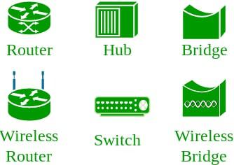

#### Network Topology

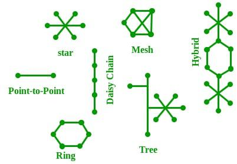

#### Unique Identifiers of Network

- **Hostname:** mỗi thiết bị trong network được gắn với một tên thiết bị duy nhất được gọi là Hostname.

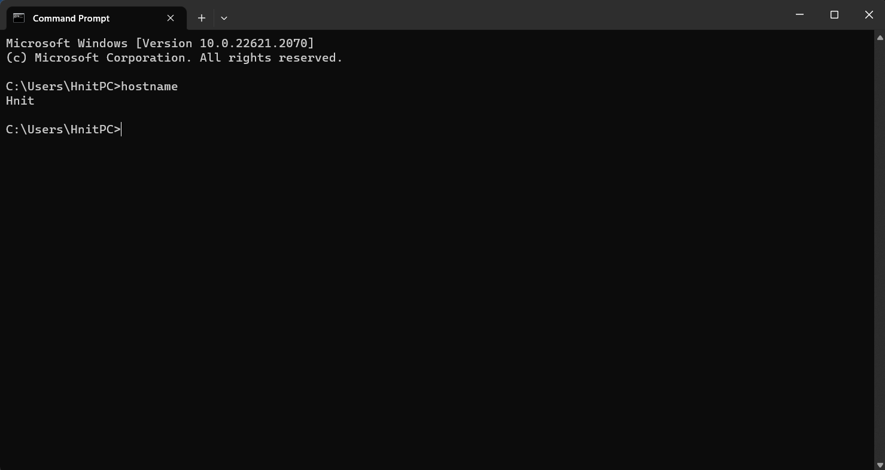

- **IP Address (Internet Protocol address):** hay còn được gọi là Logical Address. IP Address là địa chỉ của network trong hệ thống network. Để xác định mỗi device trong world-wide-web, cơ quan Internet Assigned Numbers Authority (IANA) chỉ định địa chỉ IPv4 (version 4) address là mã định danh duy nhất cho từng thiết bị trên Internet. Độ dài của địa chỉ IPv4 là 32 bits. Độ dài của địa chỉ IPv6 là 128 bits.
- **MAC Address (Media Access Control address):** còn có thể hiểu là địa chỉ vật lý, MAC Address là mã định danh duy nhất của mỗi host và được liên kết với NIC (Network Interface Card). Địa chỉ MAC được gán cho NIC tại thời điểm sản xuất. Độ dài của địa chỉ MAC là: 12-nibble/6 bytes/48 bits.

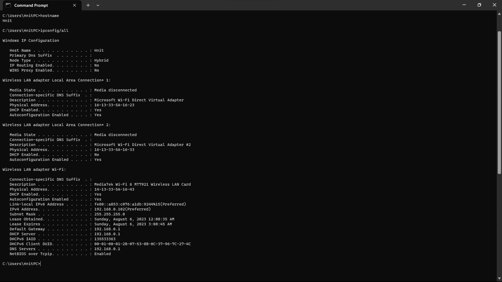

- **Port:** một Port có thể được xem là một kênh logic thông qua đó dữ liệu có thể được truyền nhận tới một application. Bất kỳ Host nào cũng có nhiều application running, và mỗi application được xác định bằng port number mà chúng đang chạy. Port number có độ dài 16-bit nguyên, và có sẵn 2^16 ports được phân loại như sau:

| Port Types       | Range         |
| ---------------- | ------------- |
| Well known Ports | 0 – 1023      |
| Registered Ports | 1024 – 49151  |
| Ephemeral Ports  | 49152 – 65535 |

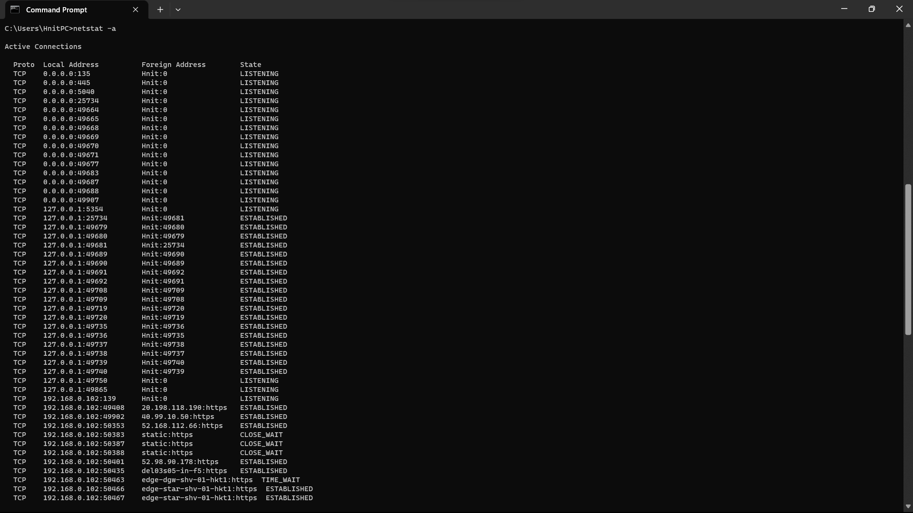

- **Socket:** là sự kết hợp của IP Address:Port.

## OSI Model

OSI là viết tắt của Open Systems Interconnection. Được phát triển bởi ISO - "International Organization for Standardization" vào năm 1984. Nó bao gồm 7 layer với mỗi layer có một chức năng khác nhau. Tất cả 7 layer hoạt động cộng tác với nhau để truyền dữ liệu từ người này sang người khác trên toàn cầu.

### Layer of OSI model

| Layer No | Layer Name         | Responsibility                                                                     | Information Form | Device or Protocol           |
| -------- | ------------------ | ---------------------------------------------------------------------------------- | ---------------- | ---------------------------- |
| 7        | Application Layer  | Helps in identifying the client and synchronizing communication.                   | Message          | SMTP                         |
| 6        | Presentation Layer | Helps in identifying the client and synchronizing communication.                   | Message          | JPEG, MPEG, GIF              |
| 5        | Session Layer      | Establishes Connection, Maintenance, Ensures Authentication, and Ensures security. | Message          | Gateway                      |
| 4        | Transport Layer    | Take Service from Network Layer and provide it to the Application Layer.           | Segment          | Firewall                     |
| 3        | Network Layer      | Transmission of data from one host to another, located in different networks.      | Packet           | Router                       |
| 2        | Data Link Layer    | Node to Node Delivery of Message.                                                  | Frame            | Switch, Bridge               |
| 1        | Physical Layer     | Establishing Physical Connections between Devices.                                 | Bits             | Hub, Repeater, Modem, Cables |

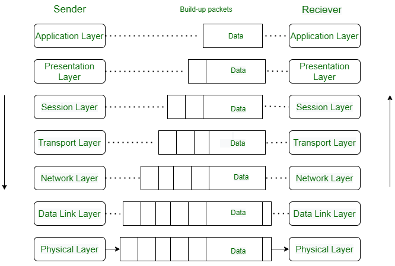

#### Layer 1. Physical Layer

Tầng thấp nhất của OSI model là Physical Layer - tầng vật lý. Chịu trách nhiệm cho kết nối vật lý thực tế giữa các thiết bị. Lớp vật lý chứa thông tin dưới dạng bit, gửi các bit dữ liệu từ các thiết bị (như máy tính) dến các thiết bị khác. Khi nhận dữ liệu, lớp này sẽ lấy tín hiệu nhận được và chuyển đổi nó thành tín hiệu nhị phân và gửi đến Data Link layer - lớp Liên kết dữ liệu, lớp này sẽ khép dữ liệu theo frame.

**Chức năng của Physical Layer:**

1. Duy trì tốc độ dữ liệu (data rate) (số lượng bit mà thiết bị gửi có thể gửi được mỗi giây).
2. Bit synchronization: physical cung cấp đồng bộ hóa bit bằng cách cấp xung clock. Clock control cả thiết bị gửi và thiết bị nhận.
3. Cung cấp các Modes of Transmition Medium - Hướng truyền dữ liệu:
   - Simplex mode: ở chế độ này, chỉ một thiết bị có thể truyền dữ liệu và thiết bị còn lại chỉ có thể nhận dữ liệu. Ví dụ: Keyboard, monitor, radio broadcasting,...
   - Half Duplex mode: ở chế độ này, cả hai thiết bị đầu cuối đều có thể truyền/nhận dữ liệu, nhưng cùng một thời điểm chỉ có thể truyền hoặc nhận.
   - Full-Duplex mode: ở chế độ này, cả hai thiết bị đầu cuối đều có thể truyền/nhận dữ liệu song song với nhau. Ví dụ: Telephone, ứng dụng chatting.
 4. Cung cấp Physical Topology (Mesh, Star, Bus, Ring).
 5. Cung cấp hai loại Line Configuration
    - Point-to-Point configuration: giữa hai thiết bị đầu cuối có một đường dây riêng để truyền nhận dữ liệu.
    - Multi-Point configuration: một line sẽ có nhiều thiết bị được kết nối.
6. Nó cung cấp một khía cạnh quan trọng được gọi là Điều chế (Modulation), chuyển đổi từ dữ liệu sang sóng radio bằng cách thêm thông tin vào tín hiệu điện hoặc quang.
7. Nó cung cấp cơ chế chuyển mạch (switching mechanism) cho phép các gói tin được chuyển tiếp từ một cổng (cổng của thiết bị gửi) đến cổng khác.

**Các Protocol thông thường của Physical Layer**

Thông thường, sự kết hợp giữa lập trình phần cứng và phần mềm tạo nên lớp vật lý. Nó bao gồm một số giao thức kiểm soát việc truyền dữ liệu trên network. Các protocols thường sử dụng là:

- Ethernet with 1000BASE-T.
- Ethernet with 1000BASE-SX.
- Ethernet at 100BaseT.
- Synchronous Digital Hierarchy/Optical Synchronisation.
- Physical-layer variations in 802.11.
- Bluetooth.
- Networking for controllers.
- U.S. Serial Bus.

#### Layer 2. Data Link Layer

Data Link Layer chịu trách nhiệm truyền dữ liệu giữa các nodes, vai trò chính là đảm bảo việc truyền dữ liệu không xảy ra lỗi, đồng thời mã hóa, giải mã và sắp xếp dữ liệu vào ra. Được xem là layer phức tạp nhất của mô hình OSI.

#### **Sub-Layer of Data Link Layer:**

Data Link Layer được chia thành hai sub-layers:

- **Logical Link Control (LLC):**

    LLC xử lý ghép kênh (multiplexing), các luồng dữ liệu giữa các ứng dụng và dịch vụ, bên cạnh đó cung cấp báo lỗi và xác nhận.
- **Media Access Control (MAC):**
    MAC sublayer quản lý việc tương tác của thiết bị, chịu trách nhiệm chỉ định địa chỉ các frames, kiểm soát truy cập các thiết bị.

Data Link Layer nhận thông tin ở dạng packets từ Network layer, sau đó phân chia packets theo frames và gửi frames từng bit một tới physical layer.

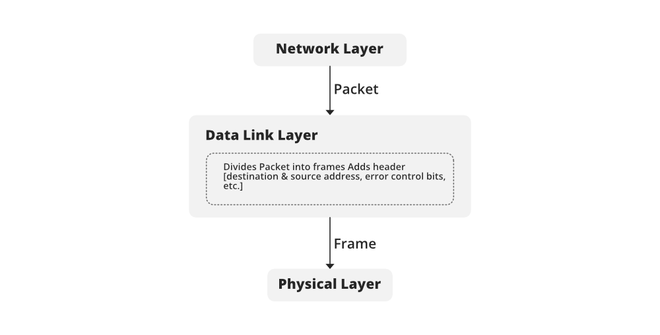

**Chức năng của Data-link Layer:**

**1. Framing:** Dữ liệu là packets từ Network layer được gọi frames trong Data link layer. Ở phía thiết bị gửi, DLL nhận các packets từ Network layer và chia chúng thành các frames nhỏ, sau đó gửi các frames theo từng bit đến Physical Layer. Nó cũng thêm các bit đặc biệt để kiểm soát lỗi và đánh địa chỉ ở phần đầu và phần cuối của frames. Ở phía thiết bị nhận, DLL lấy các bit dữ liệu từ Physical Layer và sắp xếp chúng thành các frames và gửi chúng đến Network layer.

**2. Addressing:** Data Link layer đóng gói địa chỉ MAC/Physical address vào đầu của mỗi frame để đảm bảo việc truyền dữ liệu giữa các node.

**3. Error Control:** Dữ liệu có thể bị hỏng do nhiều lý do khác nhau như nhiễu, suy giảm,... Vì vậy trách nhiệm của Data Link layer lầ phát hiện lỗi trong dữ liệu được truyền và sửa lỗi bằng các kỹ thuật phát hiện và sửa lỗi tương ứng. DLL thêm các bit phát hiện lỗi vào đầu của frame để người nhận có thể kiểm tra dữ liệu có chính xác hay không.

**4. Flow Control:** Nếu tốc độ nhận thấp hơn tốc độ gửi, điều này có thể dẫn đến việc tràn bộ nhớ đệm của thiết bị nhận và một số frames. Vì vậy, trách nhiệm của DLL là đồng bộ hóa tốc độ của thiết bị gửi và thiết bị nhận và thiết lập kiểm soát luồng giữa chúng.

**5. Access Control:** Khi nhiều thiết bị chia sẻ cùng một kênh liên lạc, khả năng xảy ra xung đột cao, do đó DLL có trách nhiệm kiểm tra xem thiết bị nào có quyền kiểm soát kênh và CSMA/CD (Carrier Sense Multiple Access/ Collision Detection) và CSMA/CA (Carrier Sense Multiple Access / Collision Avoidance) có thể được sử dụng để tránh xung đột và mất khung trong kênh.

**Các Protocols thường dùng trong Data Link layer:**

- Synchronous Data Link Protocol (SDLC).
- High-Level Data Link Protocol (HDLC).
- Serial Line Interface Protocol (SLIP).
- Point to Point Protocol (PPP).
- Link Access Procedure (LAP).
- Link Control Protocol (LCP).
- Network Control Protocol (NCP).

#### **Layer 3. Network Layer**

Chức năng chính của Network Layer là chuyển các network packet từ source đến destination. Nó liên quan đến cả source host và destination host. Tại source, nó nhận một packet từ Transport layer, đóng gói packet trong một datagram, sau đó chuyển packet đến Data Link layer để nó có thể được gửi tiếp đến thiết bị nhận. Tại destination, datagram được giải mã và packet được giải nena và chuyển đến Transport layer tương ứng.

**Đặc điểm của Network layer:**

- Trách nhiệm chính của Network layer là mang các data packet từ nguồn đến đích mà không thay đổi hoặc sử dụng chúng.

- Nếu các data packets quá lớn để tuyển, chúng sẽ bị phân mảnh, tức là được chia thành các packet nhỏ hơn.

- Nó quyết định tuyến đường mà các data packets sẽ đi từ nguồn đến đích trong số nhiều tuyến đường có sẵn trong mạng (còn gọi là định tuyến).

- Địa chỉ nguồn và đích được thêm vào các data packet bên trong lớp mạng.

**Các service được cung cấp bởi Network layer**

**1. Packetizing:**
   - Source Host thêm các header chứa địa chỉ của destination host và thông tin liên quan khác theo yêu cầu của Network protol và tải trọng (payload) nhận được từ giao thức lớp trên và gửi đến Data Link layer.
    - Destination host nhận packet từ Data Link layer, giải mã packet và chuyển tải trọng đến các lớp trên.
    - Các bộ định tuyến trong đường dẫn không được phép thay đổi địa chỉ nguồn hoặc địa chỉ đích. Các bộ định tuyến trong đường dẫn không được phép giải mã các gói mà chúng nhận được trừ khi chúng cần được phân mảnh.
    
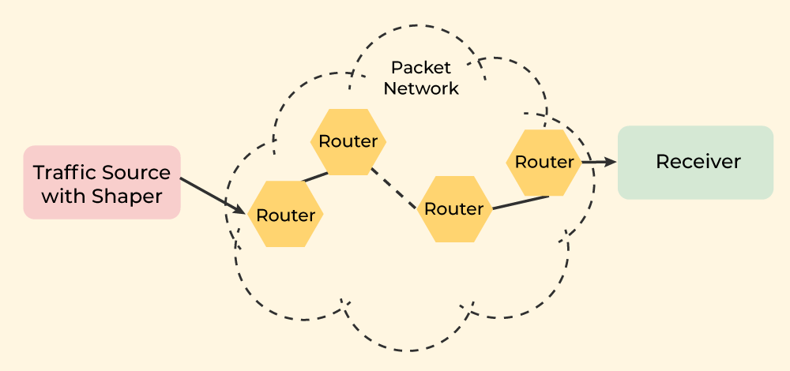

**2. Routing:**
    Routing là quá trình chuyển dữ liệu từ thiết bị này đến thiết bị khác. Trong network có một số tuyến sẵn có từ source đến destination. Network layer chỉ định ra tuyến nào là tố nhất có thể. Quá trình này gọi là định tuyến - routing. Hoạt động dựa trên các giao thức như Routing Information Protocol (RIP) cho định tuyến.
    
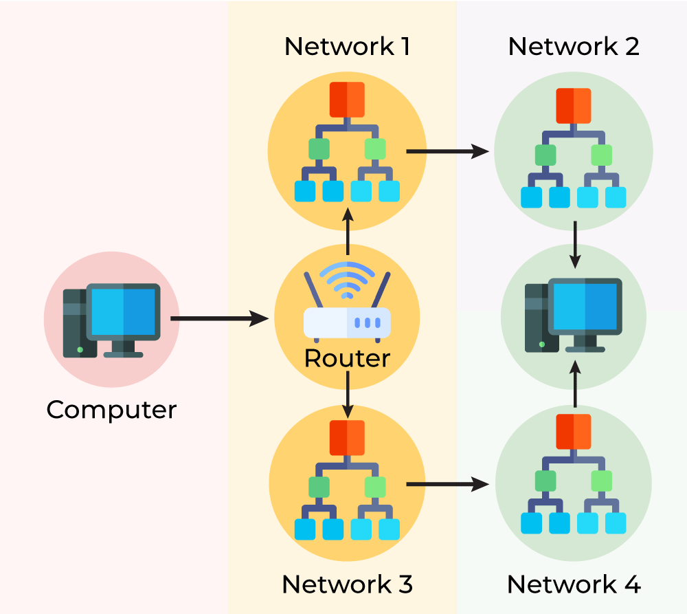

**3. Forwarding**
    Forwarding có nghĩa là hành động của router khi một packet đến được một trong các interface của nó. Khi một router nhận được một packet từ một network được gắn với nó, nó cần chuyển tiếp (forward) packet đó đến các network khác. Router được sử dụng trên netword để chuyển tiếp các packet từ local network sang remote network. Hoạt động trên các giao thức UDP Encapsulating Security Payloads.

#### **Layer 4. Transport Layer**

Transport layer là lớp end-to-end layer, chịu trách nhiệm phân phối từ đầu đến cuôi một message hoàn chỉnh. Được gọi là end-to-end layer (lớp đầu cuối) bởi vì nó cung cấp kết nối kiểu point-to-point thay vì hop-to-hop, giữa source host và destination host để cung cấp service đáng tin cậy. Đơn vị đóng gói trong Transport layer được gọi là một Segment (phân đoạn).

**Working of Transport Layer**

Transport layer lấy service từ Application layer và cung cấp service đến Network layer.

- **Ở phía thiết bị gửi:** Transport layer nhận dữ liệu (message) từ Application layer và thực hiện Segmentation, phân chia message thành các segments, thêm source và destination's port number vào phần đầu (header) của segment, và gửi message đến Network layer.
- **Ở phía thiết bị nhận:** Transport layer nhận dữ liệu từ Network layer, tập hợp lại (reassembles) các segments, đọc header, xác định port number và chuyển tiếp message đến port thích hợp ở Application layer.

**Trách nhiệm của Transport Layer**

**1. The Process to Process Delivery:**
    
- Trong khi Data Link layer yêu cầu MAC address của source/destination host để truyền đúng các frame, Network layer cần IP Address để định tuyến đúng các packets, thì Transport Layer nó cần Port number để chuyển các data segment đến đúng process trong số nhiều process đang chạy trên host cụ thể.

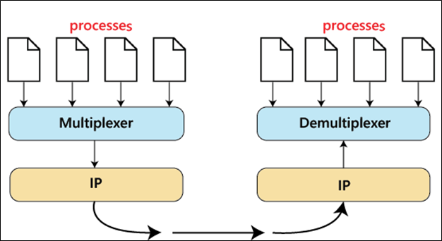

**2. End-to-end Connection between Hosts:**
    
- Transport layer chịu trách nhiệm tạo kết nối đầu cuối giữa các Host mà nó sử dụng chủ yếu TCP và UDP.
  - TCP - Transmission Control Protocol là giao thức đáng tin cậy hơn, định hướng kết nối (connection-orientated) dùng giao thức handsake để khởi tạo một kết nối mạnh mẽ giữa hai host đầu cuối. TCP đảm bảo gửi message đáng tin cậy nhưng tốc độ thấp hơn UDP.
  - UDP - User Datagram Protocol là một giao thức không trạng thái (stateless) và không đáng tin cậy bằng TCP, bảo đảm tốc độ truyền tốt nhất. Nó thường dùng trong các ứng dụng ít quan tâm đến kiểm soát luồng hoặc lỗi dữ liệu, thiếu dữ liệu. Thường được sử dụng trong các giao thức multicasting.

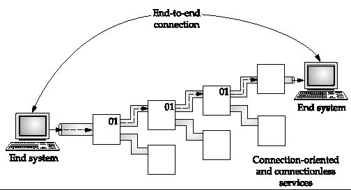

**3. Multiplexing and Demultiplexing:**

- Multiplexing (many to one) là khi mà dữ liệu được lấy từ nhiều process từ thiết bị gửi và được hợp nhất thành một packet cùng với các header và được gửi dưới dạng một packet. Multiplexing cho phép sử dụng đồng thời các process khác nhau qua mạng đang chạy trên host.
- Demultiplexing (one to many) được yêu cầu ở phía thiết bị nhận khi một message được phân thành các proccess khác nhau. Transporter nhận các segment của dữ liệu từ Network layer và chuyển nó đến các process đang chạy trên thiết bị nhận.

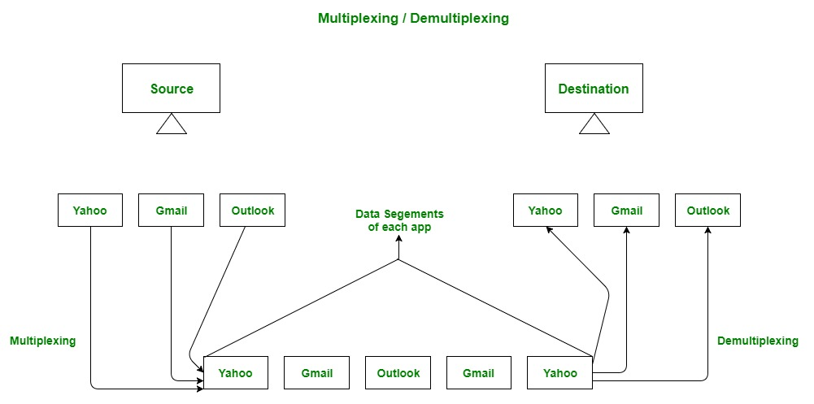

**4. Congestion Control:**

- Tắc nghẽn là tình huống trong đó có quá nhiều source thông qua network cố gắng gửi dữ liệu và bộ đệm của router bắt đầu tràn do mất packet xảy ra. Kết quả là, việc truyền lại các packet từ source sẽ làm tăng tắc nghẽn hơn nữa. Trong tình huống này, Transport layer cung cấp Kiểm soát tắc nghẽn theo những cách khác nhau. Nó sử dụng điều khiển tắc nghẽn vòng mở (open-loop congestion control) để ngăn chặn tắc nghẽn và kiểm soát tắc nghẽn vòng kín (closed-loop congestion control) để loại bỏ tắc nghẽn trong mạng khi nó xảy ra. TCP cung cấp AIMD – Additive Increases Multiplicative decrease và Leaky Bucket Technique để kiểm soát tắc nghẽn.

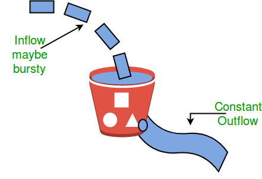

**5. Data integrity and Error Correction:**

- Transport layer kiểm tra lỗi trong các message đến từ Application layer bằng cách sử dụng error detection codes, computing checksums. Kiểm tra xem dữ liệu có phát sinh lỗi hay không và sử dụng ACK, NACK service để thông báo cho thiết bị gửi dữ liệu đã đến được hay chưa và kiểm tra tính bảo toàn dữ liệu.

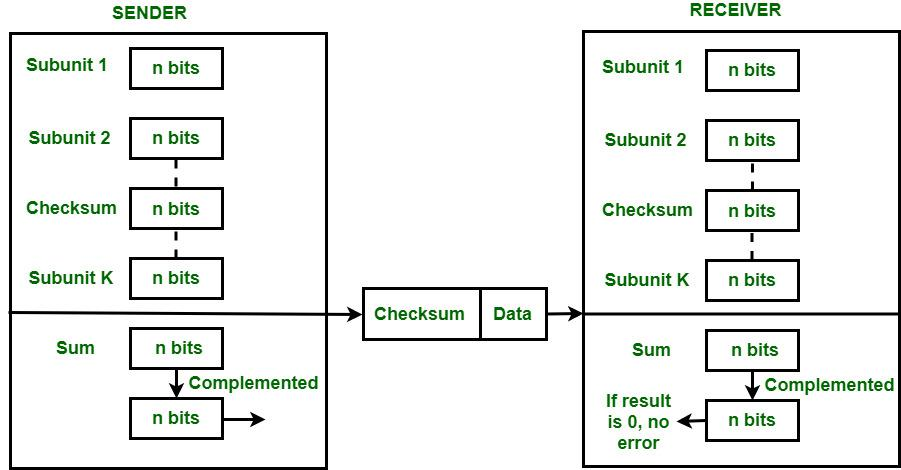

**6. Flow Control:**

- Transport layer cung cấp cơ chế điều khiển luồng giữa các lớp liền kề của mô hình TCP/IP. TCP cũng ngăn ngừa mất dữ liệu do thiết bị gửi nhanh và thiết bị nhận chậm bằng cách áp dụng một số kỹ thuật kiểm soát luồng. Nó sử dụng phương pháp giao thức sliding window protocol được thực hiện bởi thiết bị nhận bằng cách gửi một window trở lại thiết bị gửi để thông báo kích thước dữ liệu mà nó có thể nhận được.

**Các protocols của Transport Layer:**

- Transmission Control Protocol (TCP)
- User Datagram Protocol (UDP)
- Stream Control Transmission Protocol (SCTP)
- Datagram Congestion Control Protocol (DCCP)
- AppleTalk Transaction Protocol (ATP)
- Fibre Channel Protocol (FCP)
- Reliable Data Protocol (RDP)
- Reliable User Data Protocol (RUDP)
- Structured Steam Transport (SST)
- Sequenced Packet Exchange (SPX)

#### **Layer 5. Session Layer**

Session Layer cho phép người dùng trên các máy khác nhau thiết lập các phiên giao tiếp giữa chúng. Nó chịu trách nhiệm thiết lập, duy trì, đồng bộ, chấm dứt các phiên làm việc giữa các ứng dụng của người dùng cuối. Trong Session Layer, các luồng dữ liệu được nhận và được đánh dấu thêm, sau đó được đồng bộ hóa lại đúng cách để phần cuối của message ban đầu không bị cắt và tránh mất thêm dữ liệu. Về cơ bản, lớp này thiết lập kết nối giữa các thực thể phiên. Layer này xử lý và thao tác dữ liệu mà nó nhận được từ Session Layer cũng như từ Presentation Layer.

**Working of Session Layer:**

Session Layer sử dụng các services do Transpost Layer cung cấp, cho phép các applications thiết lập và duy trì các phiên cũng như đồng bộ hóa các phiên. Để thiết lập kết nối phiên, cần tuân thủ một số điều:

- Nên ánh xạ session address đến shipping address.
- Cần chọn các tham số chất lượng dịch vụ truyền tải cần thiết (Quality of Service - QoS).
- Cần quan tâm đến các xung đột sẽ xảy ra giữa các session parameters.
- Transmit limited transparent user data.
- Cần theo dõi đúng Data Transfer phase. Khả năng gửi số lượng tệp dữ liệu lớn hơn là vô cùng quan trọng và cần thiết.

**Functions of Session Layer:**

Session Layer thực hiện một số chức năng quan trọng cần thiết để thiết lập cũng như duy trì kết nối an toàn và bảo mật.

- Session Layer hoạt động như một bộ điều khiển hộp thoại (dialog controller) thông qua đó cho phép các hệ thống giao tiếp ở chế độ half-duplex hoặc full duplex communiaction.
- Chịu trách nhiệm quản lý mã thông báo (token), qua đó nó ngăn hai thiết bị cùng đồng thời truy cập hoặc cố gắng thực hiện cùng một hoạt động quan trọng.
- Thực hiện đồng bộ hóa bằng cách cho phép process thêm các checkpoints, được coi là điểm đồng bộ hóa với các luồng dữ liệu.
- Chịu trách nhiệm kiểm tra phiên và phục hồi.
- Về cơ bản, Session Layer cung cấp cơ chế mở, đóng và quản lý phiên giữa các quy trình ứng dụng của người dùng cuối (end-user).
- Chịu trách nhiệm đồng bộ hóa thông tin từ các nguồn khác nhau.
- Kiểm soát một hoặc nhiều kết nối cho từng end-user application và giao tiếp trực tiếp với cả Presentation and Transport Layers.
- Tạo các thủ tục cho điểm kiểm tra, sau đó là tạm dừng, khởi động lại và kết thúc.
- Lớp phiên sử dụng các checkpoints để kích hoạt các phiên giao tiếp sẽ được tiếp tục từ điểm kiểm tra cụ thể đã xảy ra lỗi giao tiếp.

**Session Layer Protocols:**

- AppleTalk Data Stream Protocol (ADSP).
- Real-time Transport Control Protocol (RTCP).
- Point-to-Point Tunneling Protocol (PPTP).
- Password Authentication Protocol (PAP).
- Remote Procedure Call Protocol (RPCP).
- Sockets Direct Protocol (SDP).

#### **Layer 6. Presentation Layer**

Còn được gọi là Translation layer - lớp Dịch thuật, vì layer này giữ vai trò là bộ dịch dữ liệu cho network. Dữ liệu mà layer  này nhận được từ Application Layer được trích xuất và thao tác tại đây theo định dạng được yêu cầu để truyền qua network. Trách nhiệm chính của layer này là cung cấp hoặc xác định định dạng và mã hóa dữ liệu. Lớp trình bày còn được gọi là Syntax layer - lớp Cú pháp vì nó chịu trách nhiệm duy trì đúng cú pháp của dữ liệu mà nó nhận hoặc truyền tới (các) layer khác.

**Functions of Presentation Layer:**

- Định dạng layer trình bày và mã hóa dữ liệu được gửi qua network.
- Layer này đảm bảo rằng dữ liệu được gửi theo cách mà thiết bị nhận sẽ hiểu thông tin (dữ liệu).
- Lớp này quản lý các cấu trúc dữ liệu trừu tượng (abstract data structures) và cho phép các cấu trúc dữ liệu cấp cao, sẽ được xác định hoặc trao đổi.
- Layer này thực hiện mã hóa ở bên thiết bị gửi và giải mã ở thiết bị nhận.
- Thực hiện nén dữ liệu để giảm băng thông của dữ liệu được truyền (mục tiêu chính của nén dữ liệu là giảm số bit được truyền).
- Chịu trách nhiệm về khả năng tương tác (khả năng máy tính trao đổi và sử dụng thông tin) giữa các phương pháp mã hóa khi các máy tính khác nhau sử dụng các phương pháp mã hóa khác nhau.
- Tích hợp tất cả các định dạng thành một định dạng chuẩn để giao tiếp hiệu quả.
- Xử lý cú pháp (syntax) và ngữ nghĩa (semantics) của message.
- Dảm bảo rằng các message được trình bày cho tầng trên cũng như tầng dưới phải được chuẩn hóa và phải ở định dạng chính xác.
- Dịch thuật, định dạng và phân phối thông tin để xử lý hoặc hiển thị.
- Thực hiện tuần tự hóa (quá trình dịch cấu trúc dữ liệu hoặc đối tượng sang định dạng có thể được lưu trữ hoặc truyền đi dễ dàng).

**Presentation Layer Protocols:**

- Apple Filing Protocol (AFP).
- Lightweight Presentation Protocol (LPP).
- NetWare Core Protocol (NCP).
- Network Data Representation (NDR).
- External Data Representation (XDR).
- Secure Socket Layer (SSL).

#### **Layer 6. Presentation Layer**

Layer này cung cấp một số cách để thao tác với dữ liệu (thông tin), cho phép bất kỳ loại người dùng nào truy cập network một cách dễ dàng. Lớp này cũng đưa ra yêu cầu đối với lớp dưới cùng của nó, là lớp trình bày để nhận các loại thông tin khác nhau từ nó. The Application Layer tương tác trực tiếp với application và cung cấp các web application services phổ biến. Tầng này về cơ bản là mức cao nhất của hệ thống mở, cung cấp các dịch vụ trực tiếp cho người dùng sử dụng.

**Functions of Application Layer:**

- Cho phép người dùng truy cập, truy xuất và quản lý tệp trong máy tính từ xa.
- Cho phép người dùng đăng nhập như một nemote host.
- Nó cung cấp các giao thức cho phép phần mềm gửi và nhận thông tin cũng như trình bày dữ liệu có ý nghĩa cho người dùng.
- Xử lý các vấn đề như tính minh bạch của mạng, phân bổ tài nguyên.
- Phục vụ như một cửa sổ cho người dùng và các tiến trình ứng dụng truy cập các dịch vụ mạng.
- The application layer thực sự là một lớp trừu tượng chỉ định các giao thức được chia sẻ và các phương thức giao diện được sử dụng bởi các máy chủ trong mạng truyền thông.

**Application Layer Protocols:**

- TELNET - Telecommunications Network.
- DNS - Domain Name System.
- DHCP - Dynamic Host Configuration Protocol.
- FTP - File Transfer Protocol.
- SMTP - Simple Mail Transfer Protocol.
- HTTP - Hyper Text Transfer Protocol.
- NFS - Network File System.
- SNMP - Simple Network Management Protocol.

## TCP/IP Model

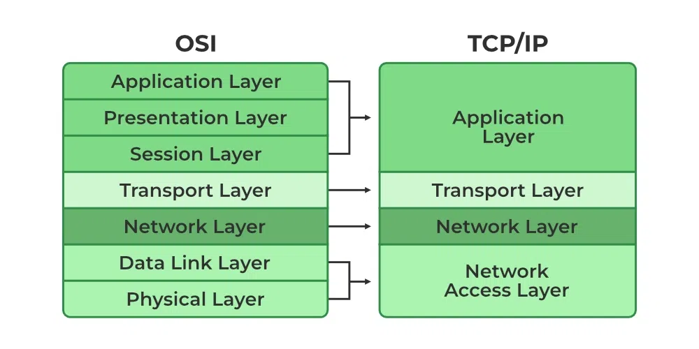

