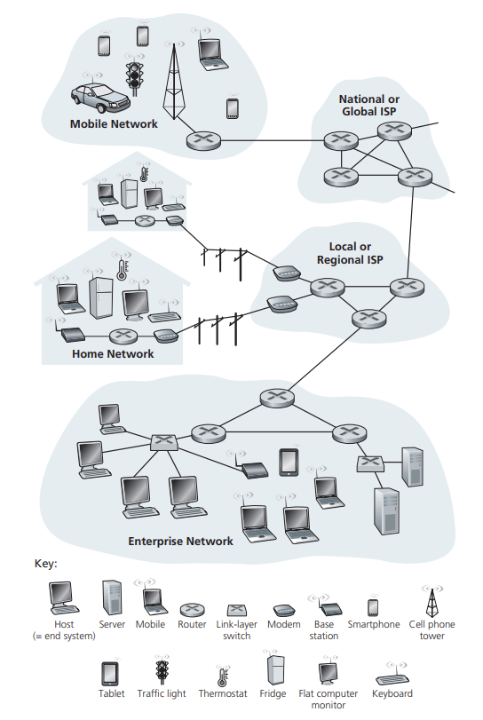
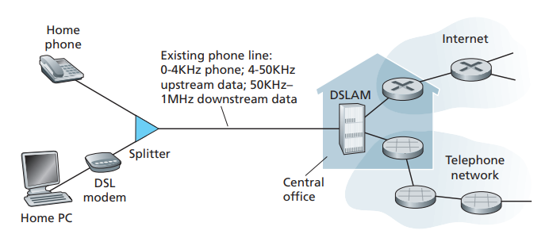
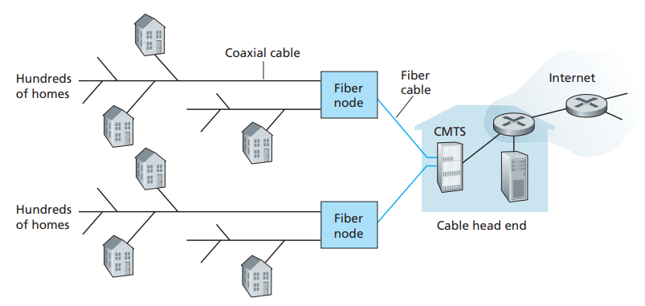
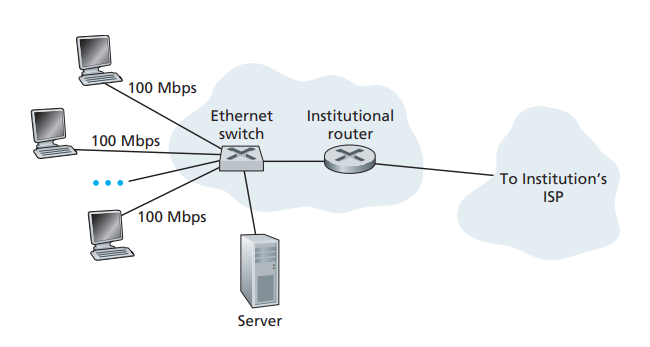
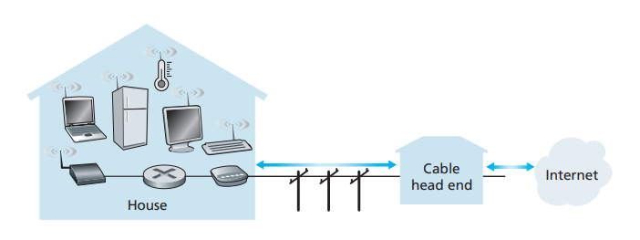
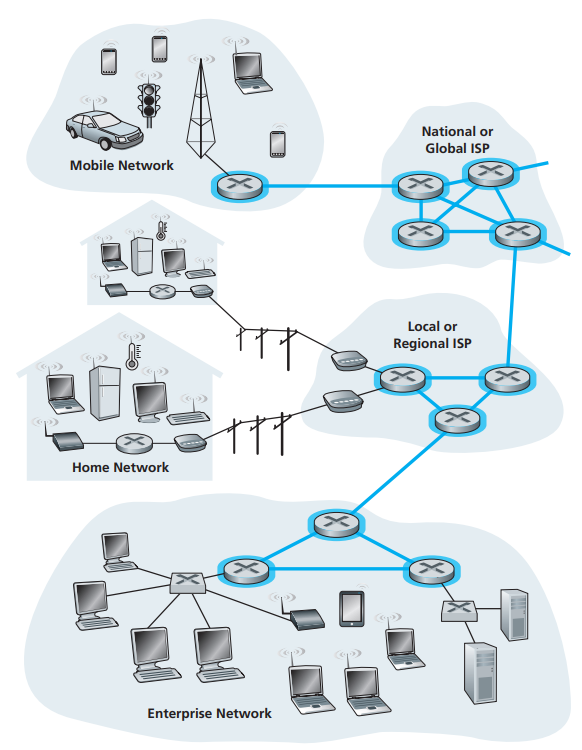
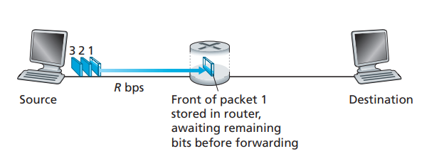
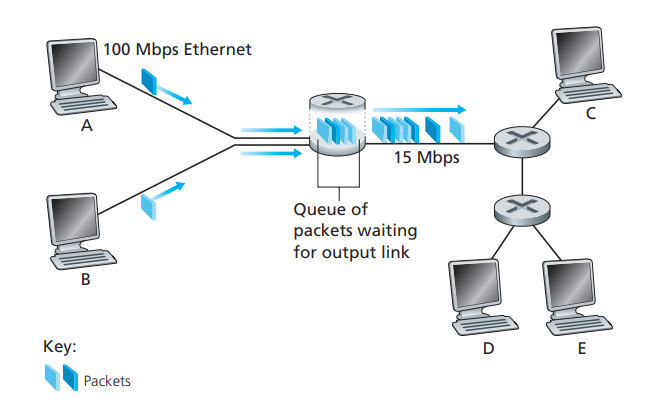

# Báo cáo tuần 4 (07/08/23 - 13/08/23)

# Computer Networking

## What is Internet?

Internet là một Computer Networking kết nối hàng tỉ các Computer device lại với nhau, các device này được gọi là host hoặc end system (thiết bị đầu cuối).

Các end system được kết nối với nhau thông qua các packet switches và communication links. Packet switch nhận một gói tin ở một trong các incomming communication links của nó và forward (chuyển tiếp) gói tin đó trên một trong các outgoing communication links của nó.

Packet switches có hai loại nổi bật nhất, đó là router (bộ định tuyến) và link-layer switches (liên kết chuyển mạng).

- Link layer switches thường được sử dụng trong các access networks.
- Router thường được sử dụng trong network core.

End systems truy cập vào Internet thông qua Internet Service Providers (ISPs). Mỗi ISP đóng vai trò vừa là một packet switches vừa là một communication links. Internet là tất cả các kết nối giữa các end system với nhau, vì vậy các ISP cung cấp quyền truy cập vào các end system phải được kết nối với nhau. Các ISP cấp thấp hơn sẽ được kết nối với nhau thông qua các ISP cấp cao hơn (ISP quốc gia và ISP quốc tế), chẳng hạn như Level 3 Communications, AT&T, Sprint, NTT. Và các ISP cấp cao hơn sẽ được kết nối với nhau bằng các high-speed routers, kết nối tốc độ cao như cáp quang.

Các đối tượng của Internet (End system, Packet switches,...) vận hành theo một giao thức để kiểm soát việc gửi và nhận thông tin trên Internet. Transmission Control Protocol (TCP) và Internet Protocol (IP) là hai protocols quan trọng nhất. IP là một giao thức giúp định dạng các gói tin được gửi và nhận giữa các end systems. Và giao thức chính của Internet chính là TCP/IP.

Khi phát triển một application kết nối đến Internet mà các end system sẽ phải trao đổi dữ liệu với nhau, application này được gọi là distributed application. Internet application vận hành trên end system chứ không vận hành trên các packet switches trong network core. Các end system được kết nối với Internet cung cấp socket interface, chỉ định cách mà một application vận hành trên một end system yêu cầu Internet phân phối dữ liệu đến một application đang vận hành trên một end system khác. Socket interface là bộ quy tắc mà một sending program phải tuân theo để Internet có thể gửi dữ liệu đúng đến destination program.

## Network Edge - Phần rìa của Internet - Biên của Internet

Host = End system, là những thiết bị kết nối với Internet. Gọi là end system vì nó nằm ở phần cuối (phần rìa) của Internet. Gọi là host vì nó vận hành các application.

Host thường được chia thành 2 phần: clients và servers. Thông thường clients sẽ là những thiết bị gửi yêu cầu, như PCs, smartphone,... Server sẽ là nơi tiếp nhận yêu cầu của clients và phản hồi cho client, thông thường sẽ là những thiết bị mạnh mẽ có thể lưu trữ và phân phối Web pages, tream video,...

### Access Network

Access Network là network kết nối vật lý giữa các end system tới first router - edge router (bộ định tuyến đầu tiên - bộ định tuyến biên).

**Home Access: DSL, Cable, FTTH, Dial-Up, and Satellite**

Hiện nay, có hai loại phổ biến nhất của truy cập băng thông rộng dân cư là digital subscriber line (DSL) và Cable.

- Digital subscriber line: truy cập Internet từ cùng một local telephone company (telco) thông qua đường dây điện thoại (wired local phone access). Vì vậy công ty viễn thông cung cấp DSL cũng chính là một ISP. 
Bộ DSL modem dùng đường dây điện thoại có sẵn (existing telephone line) để trao đổi dữ liệu với bộ Digital subscriber line access multiplexer (DSLAM) được đặt ở telco. Ở phía người dùng, tín hiệu từ telco gửi về sẽ được một bộ splitter chia thành dữ liệu và tín hiệu điện thoại và chuyển tiếp tới DSL modem. Ở phía telco, SDLAM sẽ chia tín hiệu điện thoại và dữ liệu riêng biệt để gửi vào Internet.

- Cable Internet access: truy cập Internet từ cùng một công ty truyền hình cáp (television infrastructure). Phía cuối của cable là Cable modem termination system (CMTS) server, CMTS sẽ được kết nối với trạm cáp thông qua cáp quang. Từ các trạm cáp quang (Fiber node), cáp đồng trục sẽ được sử dụng để kết nối với từng hộ gia đình. Do sử dụng đồng thời cáp quang và cáp đồng trục (fiber and coaxial cable) nên gọi là hybrid fiber coax (HFC).

**Access in the Enterprise (and the Home): Ethernet and WiFi**

Ethernet là công nghệ truy cập phổ biến dùng trong LAN. Người dùng Ethernet sử dụng twisted-pair copper wrie để kết nối với Ethernet switch. Sau đó qua router và kết nối vào Internet.

Trong một wireless LAN, người dùng sẽ truyền nhận các packets thông qua access point mà nó kết nối với các mạng doanh nghiệp mà sau cùng sẽ được kết nối có dây với Internet. Wi-fi là một wireless protocol.

**Wide-Area Wireless Access: 3G and LTE**

Các thiết di động ngày nay (như iPhone và Android) sử dụng cùng một cơ sở hạ tầng không dây cho điện thoại để gửi/nhận các packets thông qua một station được vận hành bởi mạng di động. Khác với Wi-fi, người dùng chỉ cần ở trong phạm vi vài chục km với sation. 3G - Third-generation, cung cấp khả năng truy cập Internet thông qua packet-switched wide-area tốc độ trên 1Mbps, được cải tiến thành 4G. LTE - Long-Term Evolution được bắt nguồn từ 3G và tốc độ có thể hơn 10Mbps.

## Network Core

Network Core là mạng lưới các packet switches và liên kết các end systems với nhau.

**Packet Switching**

Để gửi một message từ source end system đến một destination end system, source end system sẽ chia message thành các khối dữ liệu nhỏ hơn gọi là packets. Giữa source và destination, mỗi packet sẽ được di chuyển qua các communication links và packet switches (có hai loại chủ yếu là router và link-layer switches).

Hầu hết các packet switches sử dụng cơ chế store-and-forward tại đầu vào của các liên kết. Store-and-forward có nghĩa là packet switch phải nhận toàn bộ packet trước khi nó có thể truyền bit đầu tiên của packet ra bên ngoài.

Mỗi một packet switch có nhiều kết nối (links) được gắn với nó. Với mỗi một kết nối, packet switch sẽ có một output buffer (còn được gọi là uotput queue), chứa các packets mà router sẽ gửi qua kết nối đó. Nếu một packet đến nhưng nhận thấy link đó đang bận vì phải truyền một packet khác, thì packet phải đợi trong output buffer. Vì không gian trong buffer là có hạn nên có thể xảy ra tình trạng tràn bộ đệm, gây ra tình trạng packet loss, hoặc một trong các packet trong queue sẽ bị loại bỏ để chứa packet mới đến.

Trong Internet, mỗi end system đều có địa chỉ gọi là IP Address. Khi một source end system muốn gửi một packet đến destination end system, source end system sẽ phải đính kèm địa chỉ IP của destination end system vào packet's header. Khi packet truyền đến router của network, router sẽ kiểm tra một phần của packet's destination address và chuyển tiếp đến router liền kề.

Mỗi router sẽ có forwarding  table dùng để ánh xạ các địa chỉ đích tới các links ra bên ngoài router. Khi một packet đến router, router sẽ kiểm tra địa chỉ và tìm kiếm nó trên forwarding table, sửa dụng địa chỉ đích này để tìm đường link thích hợp ra bên ngoài. Sau đó router này sẽ hướng packet đến link ra bên ngoài này.

Internet có một số routing protocols đặc biệt được sử dụng để tự động thiết lập các forwarding tables. Routing protocol có thể xác định đường đi ngắn nhất từ mỗi router đến từng destination và sử dụng đường đi này để cáu hình forwarding table trong router.
