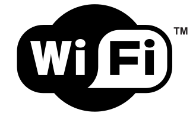
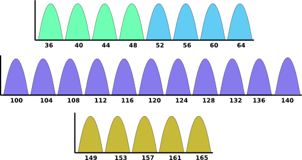

# Wi-Fi

Wi-fi là một chuẩn giao thức mạng không dây (wireless network protocol) được xây dựng trên chuẩn IEEE 802.11. Thường đươc sử dụng như một mạng cục bộ (local area networking) của một thiết bị hoặc để kết nối Internet (Internet access).

Wi-fi có nhiều versions, mỗi version khác nhau ở dãy sóng vô tuyến (radio wavebands) mà chúng hoạt động, băng thông vô tuyến (radio bandwidth) mà chúng chiếm giữ, tốc độ truyền dữ liệu tối đa mà chúng có thể hỗ trợ,...

| GENERATION / CERTIFICATION NAME | TECHNOLOGY STANDARD | FREQUENCY BAND        | NOTE                                                                                                                                                   |
| :-----------------------------: | :-----------------: | :-------------------- | :----------------------------------------------------------------------------------------------------------------------------------------------------- |
|             Wi-Fi 7             |      802.11be       | 6 Ghz, 5 GHz, 2.4 GHz | In development. The standard is not done, and the certification program has not started.                                                               |
|            Wi -Fi 6             |      802.11ax       | 5 GHz, 2.4 GHz        | Currently the latest standard. Wi-Fi Alliance started product certification of Wi-Fi 6 in September 2019, the final standard was approved in May 2021. |
|            Wi-Fi 6E             |      802.11ax       | 6 GHz, 5 GHz, 2.4 GHz | Introduced with the Wi-Fi 6 certification, exclusively for products that support Wi-Fi on the 6 GHz frequency band.                                    |
|             Wi-Fi 5             |      802.11ac       | 5 GHz                 | This designation does not distinguish between the first ax products and the latest round that includes newer technologies                              |
|             Wi-Fi 4             |       802.11n       | 5 GHz, 2.4 GHz        |                                                                                                                                                        |

Hiện nay (2023) Wi-Fi có hai loại tín hiệu, dựa trên tần số mà nó sử dụng, được gọi là Frequency Band, hay Band (dải tần số):

- **2.4 GHz:** tần số thấp, đây là công nghệ Wi-Fi được sử dụng phổ biến hiện tại. Nhiều thiết bị sử dụng loại này, nên các tín hiệu có thể trở nên chồng chập và gây nhiễu lẫn nhau. Điểm mạnh là xuyên tường tốt.
- **5 GHz:** tần số cao, các thiết bị sử dụng loại này ít hơn tần số 2.4 GHz. Loại này không thể xuyên tường tốt như 2.4 GHz, và phạm vi phủ sóng cũng ngắn hơn.

Mỗi Band được sử dụng trong Wi-Fi được chia thành nhiều `kênh` `(channels)`.

Đối với 2.4 GHz Band, có tổng cộng 14 channels. Vì các chennels chồng chéo lên nhau nên ta không thể sử dụng tất cả chúng cùng một lúc. Trong mesh network, tất cả các mesh phải cùng nằm trong một channel.

Channels nào được phép sử dụng sẽ tùy thuộc vào quốc gia mà ta đang sử dụng Wi-Fi. Ở Mỹ, channels 12, 13, 14 không được phép sử dụng.

Để hạn chế nhiễu do chồng lấp giữa các channels, tốt nhất ta nên sử dụng các channel 1, 6, 11. Có thể sử dụng các channels khác, miễn là chúng cách nhau 5 kênh. Ví dụ: channels 3, 8, 13.

Đối với 5 GHz Band, dải tần sẽ rộng hơn nhiều và sẽ có nhiều channels hơn. Các channels của 5 GHz Band không bị chồng lấp nhau như 2.4 GHz Band.

## Wi_Fi Settings

#### **`SSID`**

> SSID là viết tắt của Service Set IDentifier, và đây là tên của Wi-Fi network. SSID có độ dài tối đa 32 bit, và kí tự phải là ASCII. Các Access Point (hoặc Mesh) đều có một SSID.
> SSID được phát bởi bộ định tuyến hoặc điểm truy cập (AP) và được gửi đi dưới dạng "Beacon" (đèn hiệu). Beacon là một loại khung quản lý đặc biệt trong các mạng cục bộ không dây (WLAN) dựa trên chuẩn IEEE 802.11 và được bộ định tuyến truyền đi theo các khoảng thời gian đều đặn. Bất kỳ thiết bị nào trong phạm vi của đèn hiệu đều có thể nhìn thấy SSID. Khi kết nối với mạng không dây, máy tính sẽ tìm SSID và sau khi tìm thấy SSID, máy tính sẽ cố gắng kết nối với mạng bằng mật khẩu được cung cấp.

#### **`Security Mode`**

> Cung cấp tính bảo mật dữ liệu.
> Wired Equivalent Privacy (WEP) là tiêu chuẩn lâu đời nhất, được giới thiệu như một phần của tiêu chuẩn 802.11 ban đầu được phê chuẩn vào năm 1997. Vì những thiếu sót của nó, WEP đã bị thay thế bởi  Wi-Fi Protected Access (WPA) và sau đó là Wi-Fi Protected Access 2 (WPA2).

#### **`Password`**

> Mật khẩu của để truy cập vào Wi-Fi network.

#### **`Channel`**

> Channel mà Wi-Fi network sử dụng.

#### **`NAT`**

> Network Address Translation (NAT) là một method ánh xạ một không gian địa chỉ IP sang một không gian địa chỉ khác. Với NAT, một public IP address có thể ẩn một số private IP addresses.

#### **`QoS`**

> Quality of Service

## Địa chỉ IP - IP Address

**IP - Internet Protocol** - là một tập hợp các quy tắc quản lý định dạng dữ liệu được gửi qua Internet hoặc Local Network.

**IP Address** - là một địa chỉ duy nhất (unique address) xác định một thiết bị (device) trên Internet hoặc một Local Network.

> Về bản chất, địa chỉ IP là mã định danh cho phép gửi thông tin giữa các thiết bị trong cùng một network: chúng chứa thông tin vị trí và giúp các thiết bị có thể truy cập được để liên lạc với nhau. Internet cần một cách để phân biệt giữa các máy tính (computers), bộ định tuyến (routers) và trang web khác nhau. Địa chỉ IP cung cấp cách thực hiện và tạo thành một phần thiết yếu trong cách thức hoạt động của Internet.

#### **`IP Address`**

- IP Address là một chuỗi các số (string of number) được phân tách với nhau bằng dấu chấm `"."`. 
- Địa chỉ IP được thể hiện dưới dạng một bộ gồm bốn số. Mỗi số trong tập hợp có thể nằm trong khoảng từ 0 đến 255. Vì vậy, phạm vi địa chỉ IP đầy đủ sẽ từ `0.0.0.0` đến `255.255.255.255`.
- Địa chỉ IP không phải là ngẫu nhiên. Chúng được sản xuất và phân bổ theo toán học bởi cơ quan Internet Assigned Numbers Authority (IANA), một bộ phận của Internet Corporation for Assigned Names and Numbers (ICANN). ICANN là một tổ chức phi lợi nhuận được thành lập tại Hoa Kỳ vào năm 1998 để giúp duy trì tính bảo mật của Internet và cho phép tất cả mọi người có thể sử dụng Internet. Mỗi khi bất kỳ ai đăng ký một miền trên internet, họ sẽ thông qua một công ty đăng ký tên miền, người này sẽ trả một khoản phí nhỏ cho ICANN để đăng ký miền.

#### **`How IP Address work`**

1. Thiết bị kết nối gián tiếp với Internet bằng cách kết nối với một mạng được kết nối với Internet (gọi là Internet Service Provider (ISP)), sau đó cấp cho thiết bị quyền truy cập vào internet.
2. IP Address được ISP gán cho thiết bị.
3. Hoạt động internet của thiết bị thông qua ISP và nó định tuyến lại cho thiết bị bằng cách sử dụng địa chỉ IP của thiết bị. Vì ISP đang cấp cho thiết bị quyền truy cập Internet nên vai trò của ISP là chỉ định IP Address cho thiết bị.

#### **`Types of IP Address`**

Consumer IP addresses:

- Private IP addresses
- Public IP addresses

Public IP addresses:

- Dynamic IP addresses
- Static IP addresses

Website IP addresses:

- Shared IP addresses
- Dedicated IP addresses
